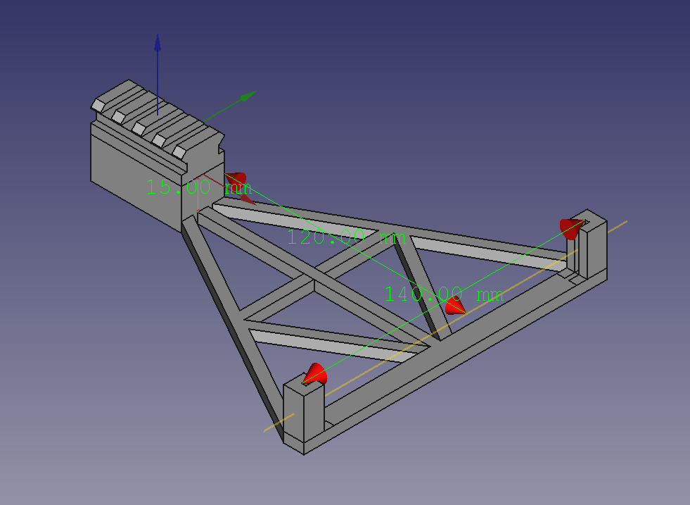
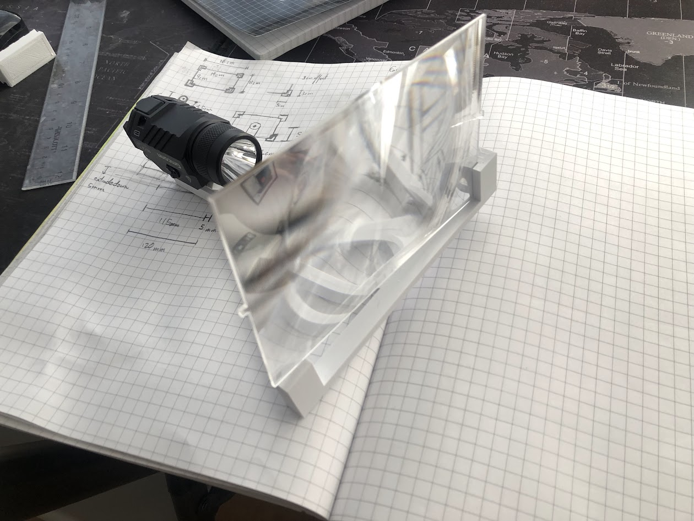
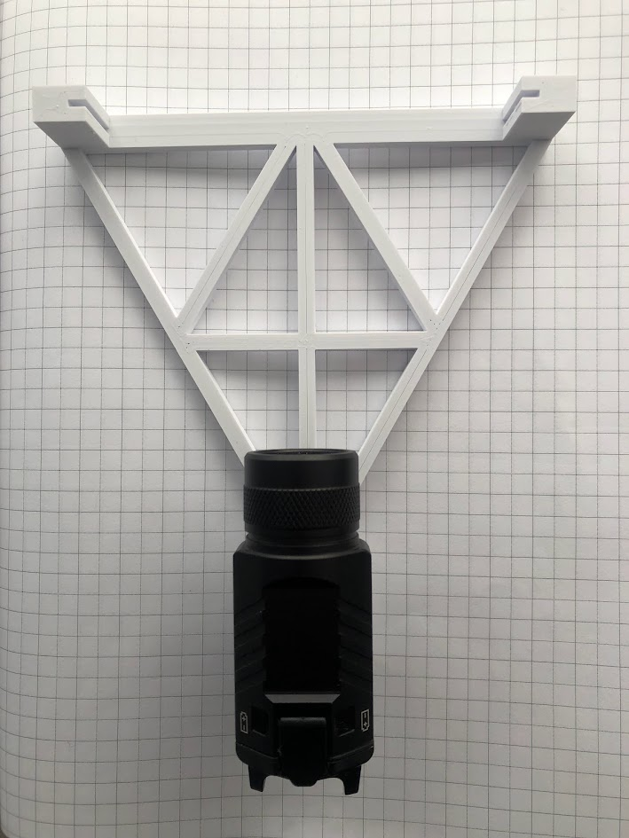

## 2-15:

    

### Changes:
- Lens bracket width fixed
- Light mount height offset increased from 0 to 15mm
- Infill Density reduced from 100% to 10%

### Print Settings:
Layer Height: 0.12 mm  
Wall Thickness: 1.2 mm  
Wall Line Count: 8  
Horizontal Expansion: 0.0 mm  
Top/Bottom Thickness: 0.84 mm  
Top Thickness: 0.84 mm  
Top Layers: 7  
Bottom Thickness: 0.84 mm  
Bottom Layers: 7  
Infill Density: 10%  
Infill Pattern: Gyroid  
Printing Temperature: 220.0 C  
Build Plate Temperature: 60.0 C  
Print Speed 45.0 mm/s  
Fan Speed 100%  
Generate Support: True  
Support Placement: Everywhere  
Support Overhang Angle: 59.0 Deg.  
Support Horizontal Expansion: 0.8 mm  
Build Plate Adhesion Type: None 

## 2-14:

    
    

### Notes:
I forgot to check the lens bracket width before printing it, so it didn't actually fit. Fixed it now, but it was kind of a foolish oversight. Not a total waste of time though; it was good to at least see a rough version irl and see what works and what needs fixed. The light mount was 15mm low after checking with a ruler; I'd originally calculated it by doing the height minus half the diameter of the housing, but it was easier to get a more accurate reading off the print. The rigidity is really good; triangles are really strong, so I'm pretty happy about that. A future project might be an analysis on the strength of different sized struts under tension / compression / bending, but for now good enough is good enough. Next print I'll try 10% infill; the struts and mounting points will still be solid because of the high wall count, but it'll save some time/material not filling in the bigger blocks. Build plate adhesion was fine; I was concerned because I couldn't fit a raft due to size constraints, but it turned out okay, so great.

### Print Settings:
Layer Height: 0.12 mm  
Wall Thickness: 1.2 mm  
Wall Line Count: 8  
Horizontal Expansion: 0.0 mm  
Top/Bottom Thickness: 0.84 mm  
Top Thickness: 0.84 mm  
Top Layers: 7  
Bottom Thickness: 0.84 mm  
Bottom Layers: 7  
Infill Density: 100%  
Infill Pattern: Gyroid  
Printing Temperature: 220.0 C  
Build Plate Temperature: 60.0 C  
Print Speed 45.0 mm/s  
Fan Speed 100%  
Generate Support: True  
Support Placement: Everywhere  
Support Overhang Angle: 59.0 Deg.  
Support Horizontal Expansion: 0.8 mm  
Build Plate Adhesion Type: None  
